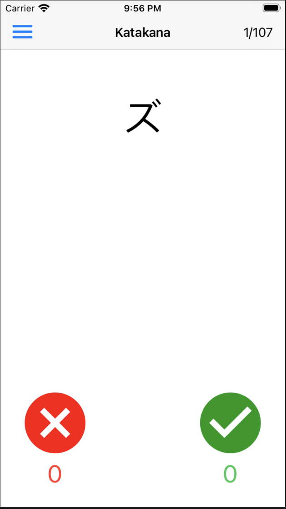
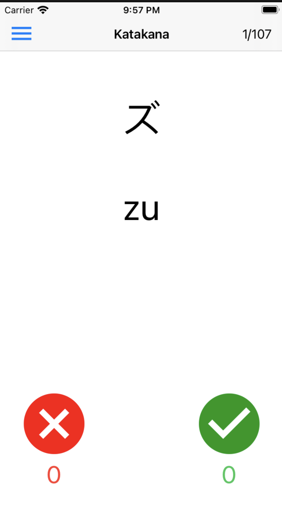
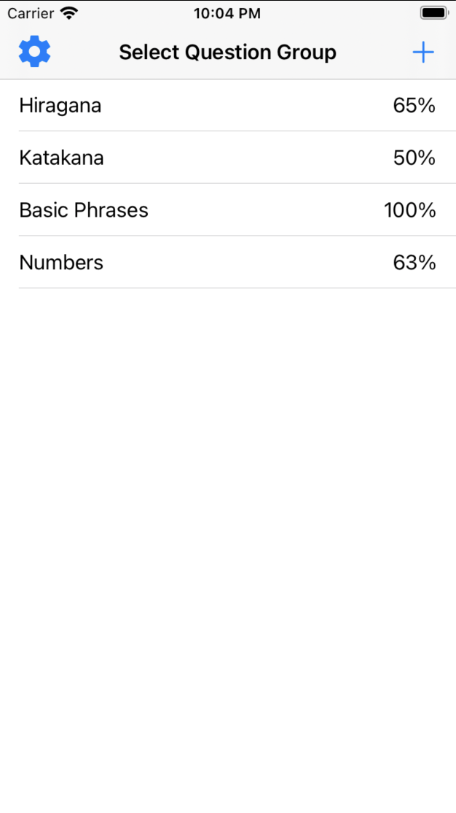
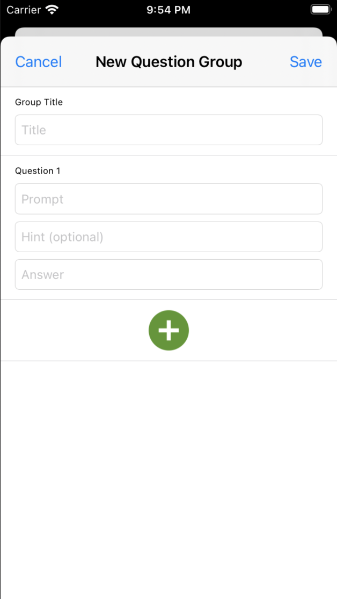

# RableWabble

## About
A case study based on [RayWendelich's iOS Design Patterns](https://www.raywenderlich.com/books/design-patterns-by-tutorials/v3.0) tutorial. 
The app consists of common design patterns found in many iOS apps, allowing the user to create  a set of questions, test their Japanese knowledge, choose between random or sequential order, save and display the user's tracked score.

## Learning Objectives
To learn common design patterns found in many iOS apps. Patterns such as
* Model-View-Controller
* Delegation
* Strategy
* Singleton
* Memento
* Observer
* Builder

## Usage
You can launch this project in Xcode and simulate the app on your preffered iOS simulator. You can also try to install it on your physical iOS device.

This app is perfect for practicing japanese! You will be greeted with a set of questions, you can choose which ever set you want to start with.
The goal is to guess the answer, check if it's correct and press on the red button if it's wrong or green if it's correct. Make sure to stay honest to yourself. You can set the questions in random or sequential order and even create your every own set of questions! A perfect Japanese quiz app to test your skills and track your own knowledge!

| Guess                           |  Check                                         | Track                                | Create                               |
:--------------------------------:|:----------------------------------------------:|:------------------------------------:|:------------------------------------:|
| Attempt a challange             |  Check if its correct by tapping on the screen |  Keep track of your score            | Create your own set!                 |
|       |                      |            |     |

## App Delegate
The app delegate files can be found in the [App delegate](https://github.com/GeorgeSolorio/RableWabble/tree/master/RableWabble/AppDelegate) folder.
This folder consits of app delegate files given by Xcode's biolerplate code in UIKit. 

## Builder 🏗
The builder files can be found in the [Builder](https://github.com/GeorgeSolorio/RableWabble/tree/master/RableWabble/Builders) folder
| File                       | Description                                                                             | Obejcts                               |
| ---------------------------|:----------------------------------------------------------------------------------------|:--------------------------------------|
| [QuestionGroupBuilder.swift](https://github.com/GeorgeSolorio/RableWabble/blob/master/RableWabble/Builders/QuestionGroupBuilder.swift) | This file contains objects that help with the creation and deletion of custom questions | QuestionGroupBuilder, QuestionBuilder |

## Caretakers 💿
The Caretakers files can be found in the [Caretaker](https://github.com/GeorgeSolorio/RableWabble/tree/master/RableWabble/Caretakers) folder
| File                       | Description                                                                             | Obejcts                               |
| ---------------------------|:----------------------------------------------------------------------------------------|:--------------------------------------|
| [DiskCaretaker.swift](https://github.com/GeorgeSolorio/RableWabble/blob/master/RableWabble/Caretakers/DiskCaretaker.swift)| This file contains objects that help write and save data onto a file | DiskCaretaker |
| [QuestionGroupCaretaker.swift](https://github.com/GeorgeSolorio/RableWabble/blob/master/RableWabble/Caretakers/QuestionGroupCaretaker.swift)| Consists of an object that saves and loads a group of questions | QuestionGroupCaretaker | 

## Controllers 🕹
The controllers files can be found in the [Controllers](https://github.com/GeorgeSolorio/RableWabble/tree/master/RableWabble/Controllers) folder
| File                       | Description                                                               |
| ---------------------------|:--------------------------------------------------------------------------|
| [AppSettingsViewController.swift](https://github.com/GeorgeSolorio/RableWabble/blob/master/RableWabble/Controllers/AppSettingsViewController.swift) | Provides information about optional settings |
| [CreateQuestionGroupViewController.swift](https://github.com/GeorgeSolorio/RableWabble/blob/master/RableWabble/Controllers/CreateQuestionGroupViewController.swift) | Helps create Question groups and setsup table view | 
| [QuestionViewController.swift](https://github.com/GeorgeSolorio/RableWabble/blob/master/RableWabble/Controllers/QuestionViewController.swift) | Displays and interacts with the user's quiz questions | 
| [SelectQuestionGroupViewController.swift](https://github.com/GeorgeSolorio/RableWabble/blob/master/RableWabble/Controllers/SelectQuestionGroupViewController.swift) | Helps display the set of questions available and provides the settings |

| File                                    | Obejcts                           | Protocol                                  |
| ----------------------------------------|:----------------------------------|:------------------------------------------|
| [AppSettingsViewController.swift](https://github.com/GeorgeSolorio/RableWabble/blob/master/RableWabble/Controllers/AppSettingsViewController.swift)         | AppSettingsViewController         | None                                      |
| [CreateQuestionGroupViewController.swift](https://github.com/GeorgeSolorio/RableWabble/blob/master/RableWabble/Controllers/CreateQuestionGroupViewController.swift) | CreateQuestionGroupViewController | CreateQuestionGroupViewControllerDelegate |
| [QuestionViewController.swift](https://github.com/GeorgeSolorio/RableWabble/blob/master/RableWabble/Controllers/QuestionViewController.swift) | QuestionViewController            | QuestionViewControllerDelegate            |
| [SelectQuestionGroupViewController.swift](https://github.com/GeorgeSolorio/RableWabble/blob/master/RableWabble/Controllers/SelectQuestionGroupViewController.swift) | SelectQuestionGroupViewController | None                                      |

## Models ℹ️
The model files can be found in the [Models](https://github.com/GeorgeSolorio/RableWabble/tree/master/RableWabble/Models) folder
| File                       | Description                                         | Obejcts                           |
| ---------------------------|:----------------------------------------------------|:----------------------------------|
| [AppSettings.swift](https://github.com/GeorgeSolorio/RableWabble/blob/master/RableWabble/Models/AppSettings.swift) |  Informs the UserDefaults about the user's settings | AppSettings, QuestionStrategyType |
| [Question.swift](https://github.com/GeorgeSolorio/RableWabble/blob/master/RableWabble/Models/Question.swift) |  Contains the model for a question                  | Question                          |
| [QuestionGroup.swift](https://github.com/GeorgeSolorio/RableWabble/blob/master/RableWabble/Models/QuestionGroup.swift) |  Contains information about the set of questions  | QuestionGroup  |

## Resources 🛍
The Resource files can be found in the [Resources](https://github.com/GeorgeSolorio/RableWabble/tree/master/RableWabble/Resources) folder

It Contains resouces such as user info, the japanese questions and app images

## Strategies 🗺
The Strategies files can be found in the [Strategies](https://github.com/GeorgeSolorio/RableWabble/tree/master/RableWabble/Strategies) folder
| File                             | Description                                                                   | Obejcts                    |
| ---------------------------------|:------------------------------------------------------------------------------|:---------------------------|
| [BaseQuestionStrategy.swift](https://github.com/GeorgeSolorio/RableWabble/blob/master/RableWabble/Strategies/BaseQuestionStrategy.swift)       | contains methods that informs and aids in the transition of questions         | BaseQuestionStrategy       |
| [QuestionStrategy.swift](https://github.com/GeorgeSolorio/RableWabble/blob/master/RableWabble/Strategies/QuestionStrategy.swift) | An interface for the methods that aid in the transition of questions | QuestionStrategy           |
| [RandomQuestionStrategy.swift](https://github.com/GeorgeSolorio/RableWabble/blob/master/RableWabble/Strategies/RandomQuestionStrategy.swift) | contains the procedure of shuffling and randomzing a given set of questions   | RandomQuestionStrategy     |
| [SequentialQuestionStrategy.swift](https://github.com/GeorgeSolorio/RableWabble/blob/master/RableWabble/Strategies/SequentialQuestionStrategy.swift) | contains the procedure of sequential set of questions                         | SequentialQuestionStrategy |

## Views 🖼
The Views files can be found in the [Views](https://github.com/GeorgeSolorio/RableWabble/tree/master/RableWabble/Views) folder
| File                         | Description                                              | Obejcts                                                        |
| -----------------------------|:---------------------------------------------------------|:---------------------------------------------------------------|
| [CreateQuestionCell.swift](https://github.com/GeorgeSolorio/RableWabble/blob/master/RableWabble/Views/CreateQuestionCell.swift)     | Contains outlet connections for the creation View.       | CreateQuestionCell                                             |
| [CreateQuestionGroupTitleCell](https://github.com/GeorgeSolorio/RableWabble/blob/master/RableWabble/Views/CreateQuestionGroupTitleCell.swift) | Creates a title based on the question name               | CreateQuestionGroupTitleCell                                   |
| [JapaneseTextField.swift](https://github.com/GeorgeSolorio/RableWabble/blob/master/RableWabble/Views/JapaneseTextField.swift) | Converts textfields into Japanese                        | JapaneseTextField, CaseBasedChart, KatakanaChart, HiraganaChart|                                                        |
| [QuestionGroupCell.swift](https://github.com/GeorgeSolorio/RableWabble/blob/master/RableWabble/Views/QuestionGroupCell.swift) | Contains the cell that displays the title and percentage | QuestionGroupCell                                              |
| [QuestionView.swift](https://github.com/GeorgeSolorio/RableWabble/blob/master/RableWabble/Views/QuestionView.swift)   | Contains outlet connections to the prompt view  | QuestionView |
| LaunchScreen.storyboard | The launch screen                                        | None                                                           |
| MainStoryboard.storyboard    | The main story board containing the prototype view       | None                                                           |
| NewQuestionGroup.storyboard  | The new custom question prototype view                   | None   
 
